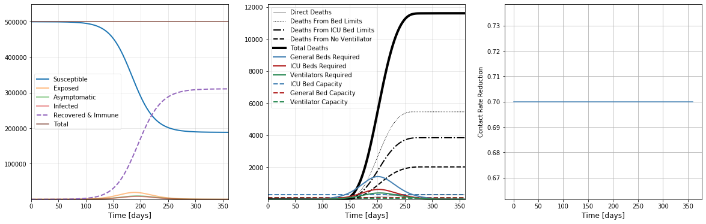
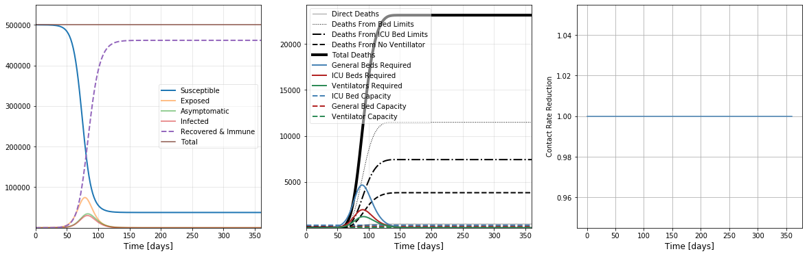

# County COVID-19 Compartmental Models
Tools for forecasting COVID-19 Propagation at the US County Level. We implement 
a generalized comparmental model based on the SEIR formalism.

## Dynamical Model Transitions

## Examples 
### Flatten the Curve

The top figure represents unsupressed COVID19 flow through the population, while
the second figure demonstrates the impact of distancing policies.

# Installation

Install miniconda python 3.7 from here [https://docs.conda.io/en/latest/miniconda.html](https://docs.conda.io/en/latest/miniconda.html)

Execute
`conda env create -f environment.yaml`

Activate the environment here..
`conda activate pyseir`

## Installing pyseir
Change to into the county_covid_seir_models directory
`pip install -e .`

# Running Models
`pyseir run-all --state=California`

This will take a few minutes to download today's data, run inference and model
ensembles, and generate the output. Then check the `output/` folder for results.

# Changelog

###4/3
1. Add hospital admissions per day
2. Add deaths per day
3. Compute surge window start/end
4. Plots case data and death data to county specific reports (still not yet fitting to death data: coming soon)
5. Add empirical suppression policiesProduce 0%, 25%, 50%, 65% mitigation projections
6. Reduce hospitalizations infection from 20% -> 10%
